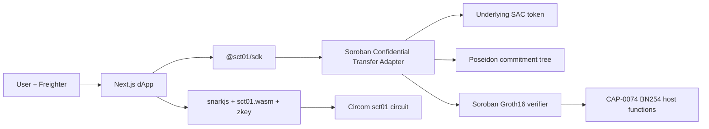

# System overview

SCT-01 separates private statement generation, on-chain validation, and app-facing integration. The separation keeps reusable protocol logic out of the dApp and keeps proof verification out of the asset adapter.

## Component responsibilities

| Component | Owns | Does not own |
| --- | --- | --- |
| Adapter | Asset vault, commitment tree, nullifier set, public consistency checks | Groth16 pairing math, note secrets |
| Verifier | Verification key, action/public-signal checks, pairing verification | Asset rules, nullifier storage |
| Circuit | Private validity statement and value conservation | Transaction submission, asset transfer |
| SDK | Shared crypto, proof packing, note manager, storage interfaces, contract client | Browser-specific UX and Freighter integration |
| dApp | Wallet connection, UX, local flow orchestration, browser proof loading | Shared contract encoding and protocol primitives |

## Ownership boundary

The SDK is the reusable integration surface. It exposes commitment/nullifier/binding helpers, `ProofGenerator`, `NoteManager`, encrypted storage adapters, and `ContractClient` methods for deposit, transfer, and withdrawal.

The dApp uses thin wrappers so existing page imports remain stable. It owns browser-only work: Freighter signing, loading circuit artifacts, building Merkle paths from local leaves, and rendering the flow.

## On-chain state

The adapter stores instance metadata and tree state, plus persistent commitment and nullifier keys:

- `Admin`, `Asset`, `Verifier`, `Metadata`.
- `TreeRoot`, `NoteCount`, and per-level `FilledSubtree` values.
- `Commitment(bytes32)` duplicate guard and `CommitmentByIndex(u64)` retrieval index.
- `Nullifier(bytes32)` spent guard.

Persistent entries and instance state use TTL extension. Indexers can observe the public events and reconstruct the commitment sequence; they cannot derive note ownership or amounts from commitments alone.
