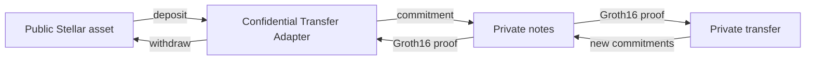

# SCT-01

**Stellar Confidential Transfer Standard** is developer infrastructure for adding private transfers to Stellar assets.

It is not a new asset, chain, or wallet ecosystem. A Stellar app uses a reference **Confidential Transfer Adapter** to lock a public Stellar Asset Contract (SAC) token, represent that value as private notes, and later release the original token again.

## Product goal

SCT-01 should become an interoperable private-transfer layer for Stellar applications:

- Wallets and dApps use one protocol shape instead of rebuilding commitments, nullifiers, proof packing, and Soroban transaction assembly.
- Each adapter represents one public asset. Deposits and withdrawals retain that asset's public liquidity and UX.
- Private transfers prove ownership, membership, and value conservation without publishing the transferred amount.
- The standard defines more than one contract: note format, event schema, public inputs, SDK behavior, and a path for future compliance extensions.

The demo dApp proves this path on testnet. It is not the product boundary or a production wallet.

## Read this site as two layers

| Layer | Meaning |
| --- | --- |
| **Protocol target** | Interoperable confidential transfers on Stellar. This is durable design intent. |
| **Current MVP** | Narrow testnet implementation in this repository. Limits and unsafe demo shortcuts are explicit in [MVP status](/mvp-status). |

> **Warning:** SCT-01 is a hackathon prototype. It is not audited and must not hold real funds.

## Core terms

| Term | Meaning |
| --- | --- |
| SAC | Stellar Asset Contract for public underlying token. |
| Adapter | Soroban contract that holds public asset, commitment tree, and spent-nullifier set. |
| Note | Local secret record representing confidential value. |
| Commitment | Opaque hash of note data stored in append-only Merkle tree. |
| Nullifier | Unique, public spend marker derived from note secrets. Prevents double spending. |
| Binding hash | Poseidon hash binding a proof to exact public operation data. |
| Verifier | Dedicated Soroban Groth16 verifier contract. |

Next: [goal and privacy model](/goal-and-privacy).
