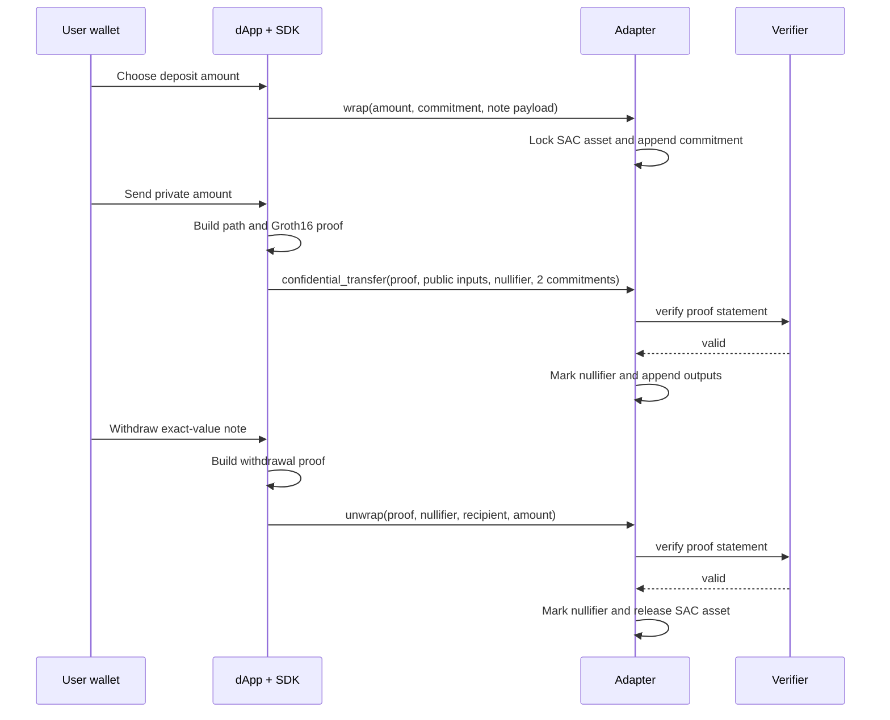

# Lifecycle

The current flow has three public operations: deposit (`wrap`), private transfer (`confidential_transfer`), and withdrawal (`unwrap`).

## 1. Deposit / `wrap`

Client creates note secrets and a commitment. The adapter requires the depositor's authorization, transfers the public SAC asset from depositor to adapter vault, inserts the commitment, and emits a `wrap` event with commitment and note-payload hash.

Deposit amount is public because the SAC transfer is public.

## 2. Private transfer / `confidential_transfer`

Client selects one unspent note, loads the current root, creates recipient and change notes, builds a Merkle path, computes encrypted-note hashes and binding hash, then generates a Groth16 proof in browser.

Adapter checks asset, root, vector sizes, output commitments, and note hashes. It requests proof verification, records the nullifier, appends two commitments, then emits `conf_transfer`.

The current circuit permits one input and exactly two outputs. Transfer amount and change amount are private.

## 3. Withdrawal / `unwrap`

Client proves ownership and membership of one note for an exact withdrawal amount. Adapter checks public recipient, amount, root, and binding; verifies proof; records nullifier; and transfers public SAC asset from its vault to recipient.

Withdrawal amount and recipient are public because the adapter executes a public token transfer.

## Note discovery is separate

The contract stores commitments and payload hashes; it cannot infer who owns a note. A usable wallet needs recipient encryption, event scanning, note decryption, and reliable local secret storage. These are required production capabilities, not merely UI polish.
